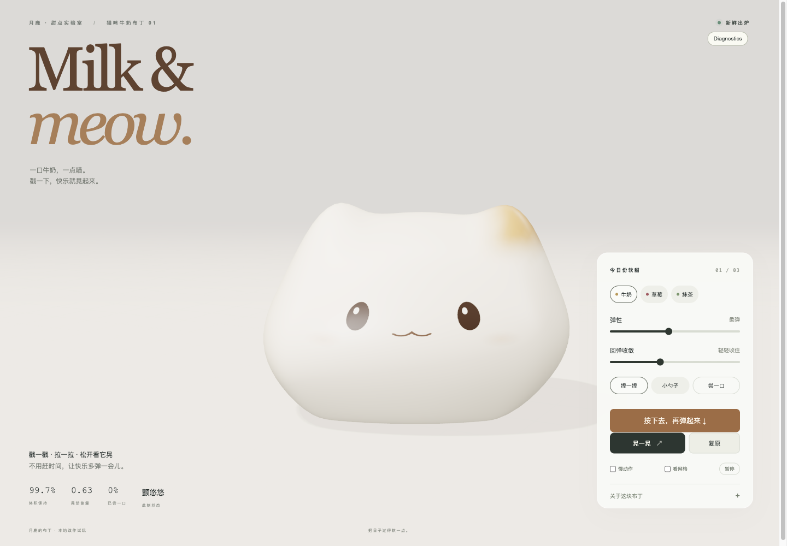

# Milk & meow · 猫咪牛奶布丁

一个可以捏、拉、按压，还能用小勺子尝一口的 3D 猫咪布丁。保留体积的软体模拟让猫咪在松手后回弹，脸部也随身体一起变形。

[在线试玩](https://lunaark.github.io/milk-meow-jelly/) · [MIT 许可证](LICENSE)



## 怎样玩

- 按住猫咪拖动，松开后观察回弹。
- 点击「按下去，再弹起来」演示挤压，或「晃一晃」轻推一下。
- 切换牛奶、草莓、抹茶；用弹性和回弹收敛滑块调整手感。
- 小勺子可以挖走一小块；「复原」恢复完整形状和默认参数。
- 支持慢动作、网格查看和暂停。窄屏下控制面板在舞台下方。

需要支持 WebGPU 的浏览器，开启硬件加速，并通过 HTTPS 或 localhost 访问。暂不提供 WebGL 回退。

## 本地运行

建议 Node.js 24。

```sh
git clone https://github.com/lunaark/milk-meow-jelly.git
cd milk-meow-jelly
npm install
npm run dev
```

```sh
npm test
npm run typecheck
npm run build
npm run preview
```

构建结果在 `dist/`，可交给静态托管服务。仓库附带 GitHub Pages 工作流；仓库 Pages 的 Source 设为 GitHub Actions 后，由主分支推送触发部署。

## 来源与改作

基于 [Aimer779/pudding-lab](https://github.com/Aimer779/pudding-lab) 改作，感谢作者提供布丁体积模拟、可抓取表面与勺子挖取实现。视觉灵感来自 [Scott (@scottstts) 的果冻演示](https://x.com/scottstts/status/2096008241104711698)。上游项目说明保存在 [docs/upstream-readme.md](docs/upstream-readme.md)。

月鹿造物的改作包括猫咪轮廓与猫耳、奶白材质、随形变的猫脸、中文界面、一键按压，以及勺子碎块闭合修复。软体求解器与固定时间步沿用上游实现。它是用于交互展示的软体模拟，不是经过物性标定的材料仿真。

## 验证

16 项测试覆盖体积保持、压缩与释放、输入取消、暂停复原、参数端点以及挖取与碎块闭合；类型检查和生产构建通过。浏览器中验证了按压、真实鼠标拖拽释放、尝一口和复原。

## 许可证

本改作版本按 [MIT](LICENSE) 发布，保留上游作者与改作者署名。上游代码的公开改作与 MIT 发布授权已由项目维护者向作者确认；此声明适用于本仓库，不代表上游仓库已自行变更许可证。

## 触屏性能

触屏设备使用 DPR 上限 1、512 像素阴影贴图及较少阴影模糊采样，桌面画质保持原配置。物理仍使用 240 Hz 固定时间步，单帧最多补算 100 毫秒，避免 10–20 fps 时额外产生慢放。长时间卡顿仍有补算上限，防止恢复时阻塞。

已检查 390×844 手机视口及模拟触摸拖拽、释放。该测试在桌面浏览器中进行，不代表真实手机或微信内置浏览器的性能。
